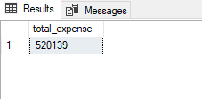

# SQL Project : Analyzing Expenses

## Analyzing Bank Statement

You are an account holder of City Bank Limited and you received your half yearly bank statement. Your job is to analyze that statement through SQL and find out key insights.
After importing the .csv file you are able to

### Total Expense In Six Month

Let's start with something simple. Let's determine the total expense of last 6 months with the following query

    ```SELECT SUM(CONVERT(INT, EXPENSE)) AS total_expense
        FROM dbo.CityBankStatement```

the results should look like this



As you can see is total expense is 520139

### Total Expense By Category

Now let's find out the expenses by category. Try to sort them in Descending order so that the highest expenditure is on the top of the query. Write the following code:

    ```SELECT DISTINCT CATEGORY,
        SUM(CONVERT(INT, EXPENSE)) AS total_expense
        FROM dbo.CityBankStatement
        WHERE EXPENSE IS NOT NULL
        GROUP BY CATEGORY
        ORDER BY total_expense DESC

The results should look like this


As you have sorted it descending so the highest expense is on top

### Highest Expense in a single Day

Let's try something complicated. you will be determining the total expenses for days and sort it descending. Try the following code

        SELECT DISTINCT DATE,
        SUM(CONVERT(INT, EXPENSE)) AS Total_expense_that_day
        FROM dbo.CityBankStatement
        WHERE EXPENSE IS NOT NULL
        AND EXPENSE <> 0
        GROUP BY DATE
        ORDER BY Total_expense_that_day DESC

The results should look like this:

.PNG>)
